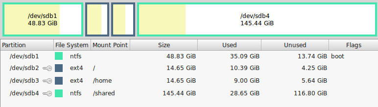
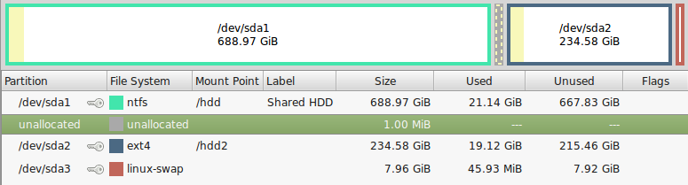

# Recommended Dev Setup #

This repo contains Ansible playbooks that installs our recommended development environment.

Currently, these playbooks only install software for web development on Linux Mint.

# Web Development Playbooks #\

er, the only playbooks.

## Installing Mint ##

Install off USB.

1. Download the iso.
1. Copy the iso following these instructions.
1. Install Mint, clicking next as required.

### Partitioning ###

If you have a modest SSD installed, say 250G or so with perhaps an additional spinning media.  We recommend partitioning like so:

 


Notable features:

* The swap space is on the spinning media.
* The SSD is split to dual boot Windows and Linux Mint
* There is a large(ish) shared NTFS space for source code.

If you are developing a web app using the MongoDB schema-less database it is advisable to have the database on spinning media, as Mongo can grow the memory mapped files to quite a large size, whether you want it to or not.  Therefore there is an ext3 (or ext4) partition on the spinning media alongside the large NTFS partition for shared files.

## Software Installation ##

So, what all is installed?  Have a look at the *.yml files.  This dev environment stops short of installing required dependencies for a particular app.  e.g. mySQL and Apache would be installed by the application Ansible playbook.

### Initial Manual Setup ###

````
sudo apt-get update
sudo apt-get upgrade
sudo apt-get install ansible git
````

This upgrades your system and installs ansible and git without which is required to continue with the Ansible Setup described below.

### Ansible Setup ###

From your *home* folder...

````
mkdir src
cd src
git clone https://github.com/sillsdev/ops-devbox
cd ops-devbox
ansible-playbook --limit localhost -K
````

and wait.

You might want to open the systems resource monitor to check on your network traffic, and to give you comfort that something is in fact happening.

### Annoying Extra Steps ###

I like remarkable as a markdown editor.  However, its no longer in the repos for the latest Mint.  You need to install it manually (via deb) from [this website](http://remarkableapp.github.io/).

